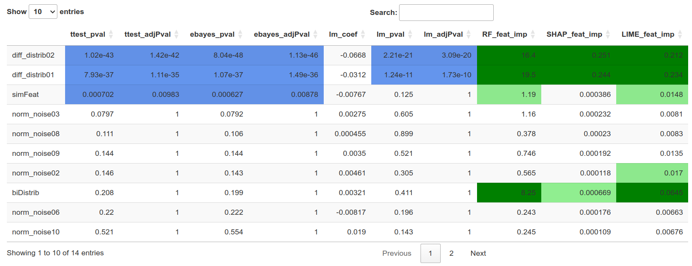
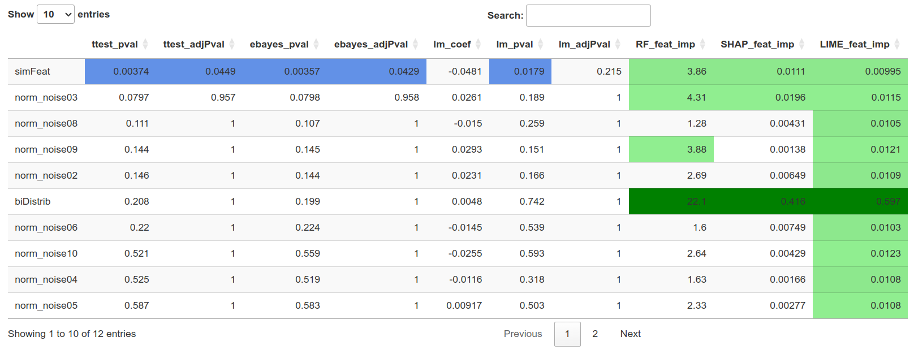
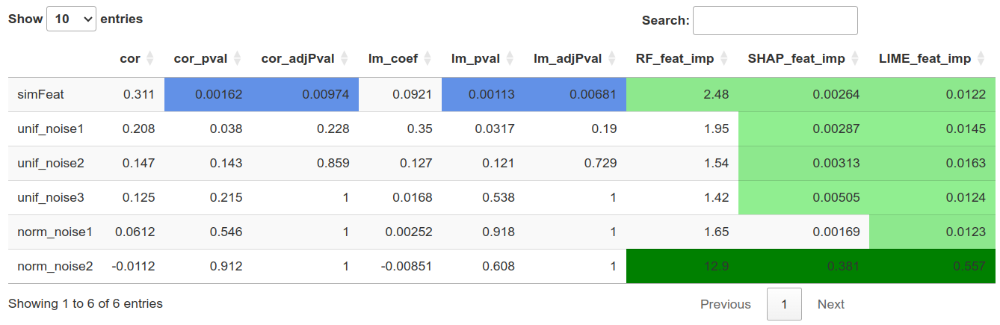

## Introduction

In biological and biomedical research, the identification of key variables in
omics data—such as transcriptomes, proteomes, and methylomes—is generally
accomplished using statistical tests like the t-test or correlation analysis.
While these methods perform well for detecting classical mean differences,
they often fail to capture more complex scenarios, such as non-Gaussian data
distributions, interactions among multiple variables, or multimodal
distributions.

To address these challenges, the scientific literature proposes to use the
potential of explainable AI (XAI) to assist in the discovery of key features.
Examples of these techniques can be found in the analysis of methylation and
transcriptome data @Rajpal_2023, @Kumar_2023.

The XAItest package aims at proposing a versatile tool to run these types of
analysis easily. It calculates various p-value based statistics, such as the
t-test or correlation, depending on whether the target variable is categorical
or numerical. It also computes different XAI matrics such as feature
importance metrics, by default a built-in method from random forest, an
implementation of SHAP and of LIME, and the possibility to integrate custom
functions.

Establishing a significance level for a p-value is straightforward, often set
at 0.05 or 0.01. However, determining thresholds for the feature importance is
more complicated, and has to be computed at each experiment. Our package offers
an integrated solution to this challenge by generating simulated data designed
to meet selected p-value thresholds, thus setting significance thresholds for
the feature importance.

Lastly, our package offers an intuitive visualization of results through
color-coded tables, highlighting statistical metrics and their significance
for easy interpretation.


# Installation
```{r installation, eval=FALSE}
if (!require("BiocManager")) {
    install.packages("BiocManager")
}
BiocManager::install('XAItest')
```

# Get feature importance of a SummarizedExperiment dataset

```{r load libs, message=F}
# Load the libraries
library(XAItest)
library(ggplot2)
library(ggforce)
library(gridExtra)
library(SummarizedExperiment)
```
We consider the RNA-seq data from the *airway* dataset, which contains read
counts per gene for airway smooth muscles stored in a
*RangedSummarizedExperiment* object. The metadata contains a column *dex*,
which indicates whether the subjects are treated or untreated. The *XAI.test*
function, by default, builds random forest models to predict a target, here
the 'dex' treatment status, and calculates the associated gene feature
importances.

```{r}
data(airway, package="airway")
se <- airway
```

```{r first XAI.test, warning=FALSE}
results <- XAI.test(se[1:100,], y = "dex", verbose = TRUE, simData = TRUE)
```

```{r}
results
```

# Detect new key features on a classification dataset
On a toy dataset we will investigate which features can be identified using a
t-test or linear modeling, and which can be detected through feature importance
metrics.

## Load simulated classification dataset
The dataset contains 50 samples of **A**, and 50 samples of **B**, with 10
noise features et 3 key features:
- **norm_noise01**, **norm_noise02** ... 10 features of normal distribution
    noise
- **diff_distrib01** different normal distributions between "A" and "B"
- **diff_distrib02** different normal distributions between "A" and "B"
- **bidistrib01** normal bidistribution for "A" and normal distribution for "B"

The t-test can detect **diff_distrib01** and **diff_distrib02** but not
**bidistrib01**. 

```{r load classif simu data}
se_path <- system.file("extdata", "seClassif.rds", package="XAItest")
dataset_classif <- readRDS(se_path)

data_matrix <- assay(dataset_classif, "counts")
data_matrix <- t(data_matrix)
metadata <- as.data.frame(colData(dataset_classif))
df_simu_classif <- as.data.frame(cbind(data_matrix, y = metadata[['y']]))
for (col in names(df_simu_classif)) {
    if (col != 'y') {
        df_simu_classif[[col]] <- as.numeric(df_simu_classif[[col]])
    }
}
```

Example with a dataframe.

```{r load dataframe ex classif simu data}
df_path <- system.file("extdata", "dfClassif.txt", package="XAItest")
dataset_classif_df <- read.table(df_path)
df_simu_classif_df <- dataset_classif
```

We can see below how class **A** and class **B** are distributed accross the
features: **norm_noise01**, **norm_noise02**, **norm_noise03**,
**norm_noise04**, **diff_distrib01**, **diff_distrib02** and **biDistrib**.

```{r fig.width=12, fig.height=5}
p1 <- ggplot(df_simu_classif, aes(x=norm_noise01, y=norm_noise02,
            color=y)) +
    geom_point() +
    ggtitle("Noise features\nnorm_noise01 vs norm_noise02") +
    theme_bw()
p2 <- ggplot(df_simu_classif, aes(x=diff_distrib01, y=diff_distrib02,
            color=y)) +
    geom_point() +
    ggtitle("Normal distributions\ndiff_distrib01 vs diff_distrib02") +
    theme_bw()
p3 <- ggplot(df_simu_classif, aes(x=norm_noise03, y=biDistrib, color=y)) +
    geom_point() +
    ggtitle("Normal bidistribution\nbidistrib01 vs norm_noise03") +
    theme_bw()
grid.arrange(p1, p2, p3, ncol = 3, nrow = 1)
```

We employ the XAI.test function to evaluate the p-values and feature importance
of each feature. The parameter *simData* is set to TRUE, which instructs the
function to generate a new feature named *simFeat*, designed to achieve a
specified p-value (column *ttest_adjPval*), set at *simPvalTarget = 0.01*.
The purpose of *simFeat* is to establish a significance threshold for assessing
feature importance values.

```{r XAI.test 1 , warning=FALSE}
set.seed(123)
objXAI <- XAI.test(dataset_classif, "y", simData = TRUE, simPvalTarget = 0.01)
```

```{r}
head(getMetricsTable(objXAI))
```

The *mapPvalImportance* function reveals the significance of the feature
importance by comparison with the p-values.

```{r mapPvalImportance1, eval=FALSE}
mapPvalImportance(objXAI)
```



We can see that the **biDistrib** feature **is not detected by the p-values**,
but is detected by the **feature importance** metrics.

## Plot each model

The *XAI.test* function builds several predictive models.
In order to provide a p-value, linear regression (lm) builds a model that we
can access. Similarly, to give feature importances, methods like the random
forest, SHAP, and LIME also build models that are accessible

The *plotModel* function is used to visualize the results of these predictive
models. This visualization helps determine which classes are well-predicted by
which model. This function aids in more effectively interpreting the model's
performance in each situation.

In this section, we aim to evaluate the performance of each model after
removing the *diff_distrib01* and *diff_distrib02* features from the dataset,
leaving only noise and the *biDistrib* features.

```{r xai2, warning=FALSE}
set.seed(123)
objXAI <- XAI.test(df_simu_classif[,setdiff(colnames(df_simu_classif),
                                    c("diff_distrib01", "diff_distrib02"))],
                  simData=TRUE)
head(getMetricsTable(objXAI))
```

We can see below that the linear model predictions contain many errors, while
the random forest, along with the models used for SHAP and LIME, are much more
precise.

```{r fig.width=10, fig.height=10}
p1 <- plotModel(objXAI, "lm_pval", "biDistrib", "simFeat")
p2 <- plotModel(objXAI, "RF_feat_imp", "biDistrib", "simFeat")
p3 <- plotModel(objXAI, "SHAP_feat_imp", "biDistrib", "simFeat")
p4 <- plotModel(objXAI, "LIME_feat_imp", "biDistrib", "simFeat")
grid.arrange(p1, p2, p3, p4, ncol = 2, nrow = 2)
```

```{r mapPvalImportance2, eval=FALSE}
mapPvalImportance(objXAI)
```


# Detect new key features on a regression dataset

First, we load a regression toy example of 100 samples, with 5 noise features,
and a *y* feature computed from one of the noise feature. We will investigate
if the feature used to compute *y* can be identified using correlation, linear
modeling, or feature importance metrics.

## Load regression simulated dataset
- **norm_noise1**, **norm_noise2**: normal distribution noise features
- **unif_noise1**, **unif_noise2** and **unif_noise3**: uniform distribution
    noise features
- **y** feature is aparabole computed from the **norm_noise2** values.

### Function of parabole
This function is invisible to the correlation test and is used to create the
output `df_simu_regr$y <- transfo_parab(df_simu_regr$norm_noise2)`.

```{r}
transfo_parab <- function(xs){
    x1 <- min(xs)
    x2 <- max(xs)
    h <- (x1 + x2) / 2
    k <- max(xs)/2
    a <- k / ((h - x1) * (h - x2))
    
    y <- a * (xs - x1) * (xs - x2)
    
    return (y)
}

```


```{r load regress simu data}
se_path <- system.file("extdata", "seRegress.rds", package="XAItest")
dataset_regress <- readRDS(se_path)

data_matrix <- assay(dataset_regress, "counts")
data_matrix <- t(data_matrix)
metadata <- as.data.frame(colData(dataset_regress))
df_simu_regr <- as.data.frame(cbind(data_matrix, y = metadata[['y']]))
for (col in names(df_simu_regr)) {
    if (col != 'y') {
        df_simu_regr[[col]] <- as.numeric(df_simu_regr[[col]])
    }
}
```

Example with a dataframe.
```{r load dataframe regress simu data}
df_path <- system.file("extdata", "dfRegress.txt", package="XAItest")
dataset_regress_df <- read.table(df_path)
df_simu_regr_df <- dataset_regress
```

```{r}
ggplot(df_simu_regr, aes(x=norm_noise2, y=y)) + geom_point() + theme_bw()
```

We employ the *XAI.test* function to evaluate the p-values and feature
importance of each feature. The parameter *simData* is set to TRUE, which
instructs the function to generate a new feature named *simFeat*, which is
designed to achieve a specified p-value (column *ttest_adjPval*), set at
*simPvalTarget = 0.01*. The purpose of *simFeat* is to establish a significance
threshold for assessing feature importance values.

```{r xai3, warning=FALSE}
set.seed(123)
regr_results <- XAI.test(dataset_regress, "y",
                            simData=TRUE, simPvalTarget = 0.01)
getMetricsTable(regr_results)
```

```{r mapPvalImportance3, eval=FALSE}
mapPvalImportance(regr_results, refPvalColumn = "cor_adjPval", refPval = 0.01)
```


The relationship between the *norm_noise2* and *y* features is not apparent
through correlation and linear modeling statistical tests, but is revealed by
the **Random Forest built-in feature importance**, as well as its **SHAP** and
**LIME** values.

## Plot each model
Similar to the classification case, the use of the *XAI.test* function creates
predictive models that we can visualize with the *plotModel* function. This
provides insights into why the *norm_noise2* feature was detected by feature
importance metrics and not by linear modeling.

```{r}
regr_results@args$modelType
```

```{r fig.width=10, fig.height=5}
p1 <- plotModel(regr_results, "lm_pval", "norm_noise2")
p2 <- plotModel(regr_results, "SHAP_feat_imp", "norm_noise2")
grid.arrange(p1, p2, ncol = 2, nrow = 1)
```

Use the *modelsOverview* function to quickly review the performance of the
models.

```{r}
modelsOverview(regr_results)
```

```{r}
sessionInfo()
```

# References