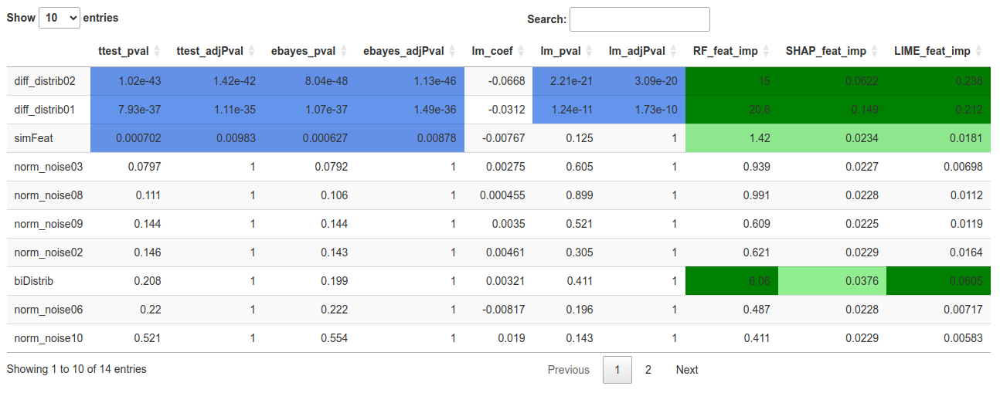
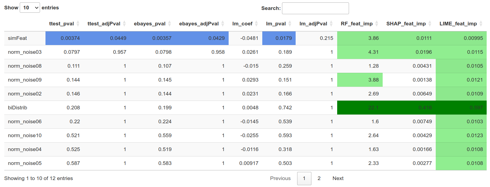
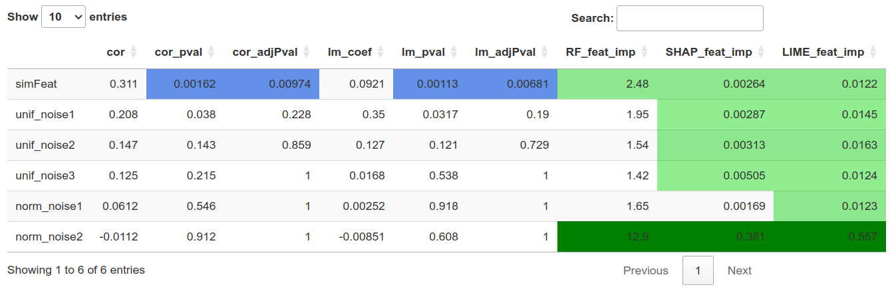
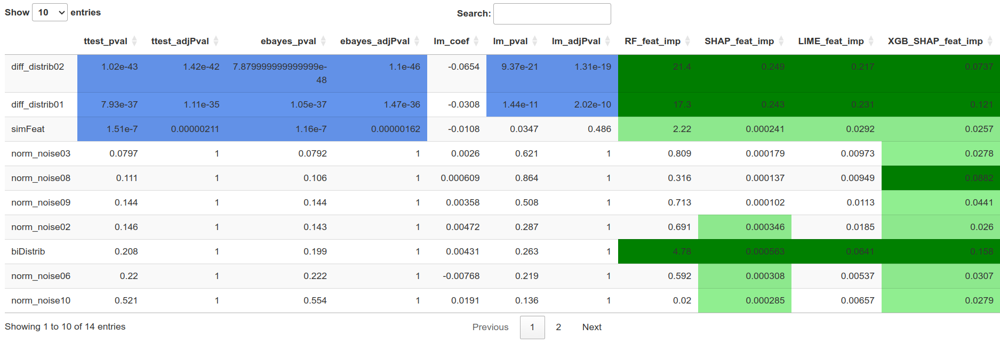

## Introduction

In biological and biomedical research, the identification of key variables in omic data—such as transcriptomes, proteomes, and methylomes—is generally accomplished using statistical tests like the t-test or correlation analysis. While these methods perform well for detecting classical mean differences, they often fail to capture more complex scenarios, such as non-Gaussian data distributions, interactions among multiple variables, or multimodal distributions.

To address these challenges, the scientific literature proposes to use the potential of explainable AI (XAI) to assist in the discovery of key features. Examples of these techniques can be found in the analysis of methylation and transcriptome data:

Rajpal S., Rajpal A., Saggar A. et al. XAI-MethylMarker: Explainable AI approach for biomarker discovery for breast cancer subtype classification using methylation data. (2023) https://doi.org/10.1016/j.eswa.2023.120130

Kumar S., Das A.. Peripheral blood mononuclear cell derived biomarker detection using eXplainable Artificial Intelligence (XAI) provides better diagnosis of breast cancer, each made with lab custom scripts. (2023) https://doi.org/10.1016/j.compbiolchem.2023.107867

The XAItest package aims at proposing a versatile tool to run these types of analysis easily. It calculates various p-value based statistics, such as the t-test or correlation, depending on whether the target variable is categorical or numerical. It also computes different XAI matrics such as feature importance metrics, by default a built-in method from random forest, an implementation of SHAP and of LIME, and the possibility to integrate custom functions.

Establishing a significance level for a p-value is straightforward, often set at 0.05 or 0.01. However, determining thresholds for the feature importance is more complicated, and has to be computed at each experiment. Our package offers an integrated solution to this challenge by generating simulated data designed to meet selected p-value thresholds, thus setting significance thresholds for the feature importance.

Lastly, our package offers an intuitive visualization of results through color-coded tables, highlighting statistical metrics and their significance for easy interpretation.


# Installation
```{r installation, eval=FALSE}
## Install BiocManager is necessary
if (!require("BiocManager")) {
    install.packages("BiocManager")
}
BiocManager::install(version="devel")
BiocManager::install('XAItest')
```

# XAI.test on a classification dataset
First, we create a toy example of 100 samples (50 from class A and 50 from class B), each with 13 features. We will investigate which features can be identified using a t-test or linear modeling, and which can be detected through feature importance metrics

```{r load libs}
# Load the libraries
library(XAItest)
library(ggplot2)
library(ggforce)
library(gridExtra)
library(SummarizedExperiment)
```


## Load simulated classification dataset
The dataset contains 50 samples of **A**, and 50 samples of **B**, with 10 noise features et 3 key features:
- **norm_noise01**, **norm_noise02** ... 10 features of normal distribution noise
- **diff_distrib01** different normal distributions between "A" and "B"
- **diff_distrib02** different normal distributions between "A" and "B"
- **bidistrib01** normal bidistribution for "A" and normal distribution for "B"

The t-test can detect **diff_distrib01** and **diff_distrib02** but not **bidistrib01**.

```{r load classif simu data}
se_path <- system.file("extdata", "seClassif.rds", package="XAItest")
dataset_classif <- readRDS(se_path)

data_matrix <- assay(dataset_classif, "counts")
data_matrix <- t(data_matrix)
metadata <- as.data.frame(colData(dataset_classif))
df_simu_classif <- as.data.frame(cbind(data_matrix, y = metadata[['y']]))
for (col in names(df_simu_classif)) {
    if (col != 'y') {
        df_simu_classif[[col]] <- as.numeric(df_simu_classif[[col]])
    }
}

# Example with a dataframe.
# df_path <- system.file("extdata", "dfClassif.txt", package="XAItest")
# dataset_classif <- read.table(df_path)
# df_simu_classif <- dataset_classif
```


We can see below how class **A** and class **B** are distributed accross the features: **norm_noise01**, **norm_noise02**, **norm_noise03**, **norm_noise04**, **diff_distrib01**, **diff_distrib02** and **biDistrib**.

```{r fig.width=12, fig.height=5}
p1 <- ggplot(df_simu_classif, aes(x=norm_noise01, y=norm_noise02, color=y)) +
    geom_point() + ggtitle("Noise features: norm_noise01 vs norm_noise02") + theme_bw()
p2 <- ggplot(df_simu_classif, aes(x=diff_distrib01, y=diff_distrib02, color=y)) +
    geom_point() + ggtitle("Normal distributions: diff_distrib01 vs diff_distrib02") + theme_bw()
p3 <- ggplot(df_simu_classif, aes(x=norm_noise03, y=biDistrib, color=y)) +
    geom_point() + ggtitle("Normal bidistribution: bidistrib01 vs norm_noise03") + theme_bw()
grid.arrange(p1, p2, p3, ncol = 3, nrow = 1)
```

We employ the XAI.test function to evaluate the p-values and feature importance of each feature. The parameter *simData* is set to TRUE, which instructs the function to generate a new feature named *simFeat*, designed to achieve a specified p-value (column *ttest_adjPval*), set at *simPvalTarget = 0.01*. The purpose of *simFeat* is to establish a significance threshold for assessing feature importance values.

```{r XAI.test 1 , warning=FALSE}
set.seed(123)
objXAI <- XAI.test(dataset_classif, "y", simData = TRUE, simPvalTarget = 0.01)
```

```{r}
head(objXAI@metricsTable)
```

The *mapPvalImportance* function reveals the significance of the feature importance by comparison with the p-values.

```{r mapPvalImportance1, eval=FALSE}
mapPvalImportance(objXAI)
```



We can see that the **biDistrib** feature **is not detected by the p-values**, but is detected by the **feature importance** metrics.

## Plot each model

The *XAI.test* function builds several predictive models.
In order to provide a p-value, linear regression (lm) builds a model that we can access. Similarly, to give feature importances, methods like the random forest, SHAP, and LIME also build models that are accessible

The *plotModel* function is used to visualize the results of these predictive models. This visualization helps determine which classes are well-predicted by which model. This function aids in more effectively interpreting the model's performance in each situation.

In this section, we aim to evaluate the performance of each model after removing the *diff_distrib01* and *diff_distrib02* features from the dataset, leaving only noise and the *biDistrib* features.

```{r xai2, warning=FALSE}
set.seed(123)
objXAI <- XAI.test(df_simu_classif[,setdiff(colnames(df_simu_classif),
                                            c("diff_distrib01", "diff_distrib02"))],
                  simData=TRUE)
head(objXAI@metricsTable)
```

We can see below that the linear model predictions contain many errors, while the random forest, along with the models used for SHAP and LIME, are much more precise.

```{r fig.width=10, fig.height=10}
p1 <- plotModel(objXAI, "lm_pval", "biDistrib", "simFeat")
p2 <- plotModel(objXAI, "RF_feat_imp", "biDistrib", "simFeat")
p3 <- plotModel(objXAI, "SHAP_feat_imp", "biDistrib", "simFeat")
p4 <- plotModel(objXAI, "LIME_feat_imp", "biDistrib", "simFeat")
grid.arrange(p1, p2, p3, p4, ncol = 2, nrow = 2)
```

```{r mapPvalImportance2, eval=FALSE}
mapPvalImportance(objXAI)
```


# XAI.test on a regression dataset

First, we load a regression toy example of 100 samples, with 5 noise features, and a *y* feature computed from one of the noise feature. We will investigate if the feature used to compute *y* can be identified using correlation, linear modeling, or feature importance metrics.

## Load regression simulated dataset
- **norm_noise1**, **norm_noise2**: normal distribution noise features
- **unif_noise1**, **unif_noise2** and **unif_noise3**: uniform distribution noise features
- **y** feature is aparabole computed from the **norm_noise2** values.

### Function of parabole
This function is invisible to the correlation test.

```{r}
transfo_parab <- function(xs){
    x1 <- min(xs)
    x2 <- max(xs)
    h <- (x1 + x2) / 2
    k <- max(xs)/2
    a <- k / ((h - x1) * (h - x2))
    
    y <- a * (xs - x1) * (xs - x2)
    
    return (y)
}

# df_simu_regr$y <- transfo_parab(df_simu_regr$norm_noise2)
```

```{r load regress simu data}
se_path <- system.file("extdata", "seRegress.rds", package="XAItest")
dataset_regress <- readRDS(se_path)

data_matrix <- assay(dataset_regress, "counts")
data_matrix <- t(data_matrix)
metadata <- as.data.frame(colData(dataset_regress))
df_simu_regr <- as.data.frame(cbind(data_matrix, y = metadata[['y']]))
for (col in names(df_simu_regr)) {
    if (col != 'y') {
        df_simu_regr[[col]] <- as.numeric(df_simu_regr[[col]])
    }
}

# Example with a dataframe.
# df_path <- system.file("extdata", "dfRegress.txt", package="XAItest")
# dataset_regress <- read.table(df_path)
# df_simu_regr <- dataset_regress
```

```{r}
ggplot(df_simu_regr, aes(x=norm_noise2, y=y)) + geom_point() + theme_bw()
```

We employ the *XAI.test* function to evaluate the p-values and feature importance of each feature. The parameter *simData* is set to TRUE, which instructs the function to generate a new feature named *simFeat*, which is designed to achieve a specified p-value (column *ttest_adjPval*), set at *simPvalTarget = 0.01*. The purpose of *simFeat* is to establish a significance threshold for assessing feature importance values.

```{r xai3, warning=FALSE}
set.seed(123)
regr_results <- XAI.test(dataset_regress, "y", simData=T, simPvalTarget = 0.01)
regr_results@metricsTable
```

```{r mapPvalImportance3, eval=FALSE}
mapPvalImportance(regr_results, refPvalColumn = "cor_adjPval", refPval = 0.01)
```


The relationship between the *norm_noise2* and *y* features is not apparent through correlation and linear modeling statistical tests, but is revealed by the **Random Forest built-in feature importance**, as well as its **SHAP** and **LIME** values.

## Plot each model
Similar to the classification case, the use of the *XAI.test* function creates predictive models that we can visualize with the plotModel function. This provides insights into why the *norm_noise2* feature was detected by feature importance metrics and not by linear modeling.

```{r}
regr_results@args$modelType
```

```{r fig.width=10, fig.height=5}
p1 <- plotModel(regr_results, "lm_pval", "norm_noise2")
p2 <- plotModel(regr_results, "SHAP_feat_imp", "norm_noise2")
grid.arrange(p1, p2, ncol = 2, nrow = 1)
```

Use the *modelsOverview* function to quickly review the performance of the models.

```{r}
modelsOverview(regr_results)
```

# Add a custom feature importance function
"The *XAItest* package includes several classic feature importance algorithms and supports the addition of new ones. To integrate an *XGBoost* model and generate its feature importance metrics using the *SHAP* package *shapr*. 

### The following function structure is required

The function should accept:
- *df*: a DataFrame where rows represent samples and columns represent features.
- *y*: the name of the target feature.
- *...*: to authorize additional arguments.

The function should return:
- *featImps*: the list of feature importance for each feature.
- *modelPredictions* (optional): the list of predictions when the model is applied to *df*, utilized in the *plotModel* function.
- *model* (optional): the model used to compute feature importance, employed in the *plotModel* function when *modelPredictions* is unavailable.

```{r}
featureImportanceXGBoost <- function(df, y="y", ...){
    # Prepare data
    matX <- as.matrix(df[, colnames(df) != y])
    vecY <- df[[y]]
    vecY <- as.character(vecY)
    vecY[vecY == unique(vecY)[1]] <- 0
    vecY[vecY == unique(vecY)[2]] <- 1
    vecY <- as.numeric(vecY)
    
    # Train the XGBoost model
    model <- xgboost::xgboost(data = matX, label = vecY, nrounds = 10, verbose = FALSE)
    modelPredictions <- predict(model, matX)
    modelPredictionsCat <- modelPredictions
    modelPredictionsCat[modelPredictions < 0.5] <- unique(as.character(df[[y]]))[1]
    modelPredictionsCat[modelPredictions >= 0.5] <- unique(as.character(df[[y]]))[2]

    # Specifying the phi_0, i.e. the expected prediction without any features
    p <- mean(vecY)
    # Computing the actual Shapley values with kernelSHAP accounting for feature dependence using
    # the empirical (conditional) distribution approach with bandwidth parameter sigma = 0.1 (default)
    explainer <- shapr::shapr(matX, model, n_combinations = 200)
    explanation <- shapr::explain(
        matX,
        approach = "empirical",
        explainer = explainer,
        prediction_zero = p,
        n_combinations = 1000
    )
    results <- colMeans(abs(explanation$dt), na.rm = TRUE)
    
    list(featImps = results, model = model, modelPredictions=modelPredictionsCat)
}
```

```{r xai4, warning=FALSE}
set.seed(123)
results <- XAI.test(dataset_classif,"y", simData = T,
                   simPvalTarget = 0.0005,
                   customFeatImps=list("XGB_SHAP_feat_imp"=featureImportanceXGBoost),
                  )
```

The *mapPvalImportance* function reveals that both the custom *XGB_SHAP_feat_imp* and other feature importance metrics identify the *biDistrib* feature as significant.

```{r mapPvalImportance4, eval=FALSE}
mapPvalImportance(results, refPvalColumn = "ttest_adjPval", refPval = 0.0005)
```


```{r}
# Plot of the XGboost generated model
plotModel(results, "XGB_SHAP_feat_imp", "diff_distrib01", "biDistrib")
```

```{r}
sessionInfo()
```

