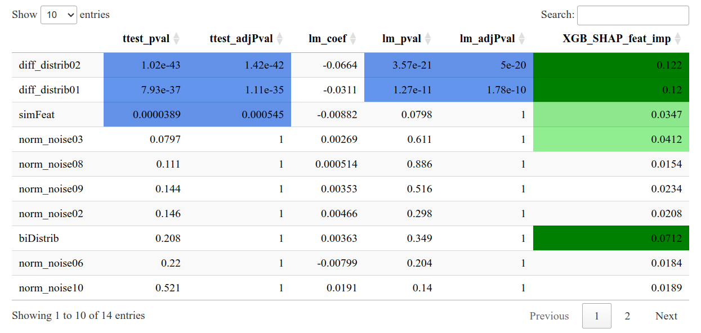

# Add a custom feature importance function
"The *XAItest* package includes several classic feature importance algorithms
and supports the addition of new ones. To integrate an *XGBoost* model and
generate its feature importance metrics using the *SHAP* package *shapr*. 

### The following function structure is required

The function should accept:
- *df*: a DataFrame where rows represent samples and columns represent
    features.
- *y*: the name of the target feature.
- *...*: to authorize additional arguments.

The function should return:
- *featImps*: the list of feature importance for each feature.
- *modelPredictions* (optional): the list of predictions when the model is
        applied to *df*, utilized in the *plotModel* function.
- *model* (optional): the model used to compute feature importance, employed
        in the *plotModel* function when *modelPredictions* is unavailable.


## Load libraries and classification dataset
```{r load libs, message=F}
# Load the libraries
library(XAItest)
library(ggplot2)
library(ggforce)
library(SummarizedExperiment)
```

```{r load classif simu data}
se_path <- system.file("extdata", "seClassif.rds", package="XAItest")
dataset_classif <- readRDS(se_path)

data_matrix <- assay(dataset_classif, "counts")
data_matrix <- t(data_matrix)
metadata <- as.data.frame(colData(dataset_classif))
df_simu_classif <- as.data.frame(cbind(data_matrix, y = metadata[['y']]))
for (col in names(df_simu_classif)) {
    if (col != 'y') {
        df_simu_classif[[col]] <- as.numeric(df_simu_classif[[col]])
    }
}
```

## Build and use the custom feature importance function

```{r}
featureImportanceXGBoost <- function(df, y="y", ...){
    # Prepare data
    matX <- as.matrix(df[, colnames(df) != y])
    vecY <- df[[y]]
    vecY <- as.character(vecY)
    vecY[vecY == unique(vecY)[1]] <- 0
    vecY[vecY == unique(vecY)[2]] <- 1
    vecY <- as.numeric(vecY)
    
    # Train the XGBoost model
    model <- xgboost::xgboost(data = matX, label = vecY,
                                nrounds = 10, verbose = FALSE)
    modelPredictions <- predict(model, matX)
    modelPredictionsCat <- modelPredictions
    modelPredictionsCat[modelPredictions < 0.5] <-
                                unique(as.character(df[[y]]))[1]
    modelPredictionsCat[modelPredictions >= 0.5] <-
                                unique(as.character(df[[y]]))[2]

    # Specifying the phi_0, i.e. the expected prediction without any features
    p <- mean(vecY)
    # Computing the actual Shapley values with kernelSHAP accounting
    # for feature dependence using the empirical (conditional)
    # distribution approach with bandwidth parameter sigma = 0.1 (default)
    explainer <- shapr::shapr(matX, model, n_combinations = 200)
    explanation <- shapr::explain(
        matX,
        approach = "empirical",
        explainer = explainer,
        prediction_zero = p,
        n_combinations = 1000
    )
    results <- colMeans(abs(explanation$dt), na.rm = TRUE)
    
    list(featImps = results, model = model,
            modelPredictions=modelPredictionsCat)
}
```

```{r xai4, warning=FALSE}
set.seed(123)
results <- XAI.test(dataset_classif,"y", simData = TRUE,
                   simPvalTarget = 0.0005,
                   customFeatImps=
                   list("XGB_SHAP_feat_imp"=featureImportanceXGBoost),
                  )
```

The *mapPvalImportance* function reveals that both the custom
*XGB_SHAP_feat_imp* and other feature importance metrics identify the
*biDistrib* feature as significant.

Display as a data.frame:
```{r mapPvalImportance4}
mpi <- mapPvalImportance(results, refPvalColumn = "ttest_adjPval", refPval = 0.0005)
head(mpi$df)
```

Display as a datatable:
```{r mapPvalImportance5, eval=FALSE}
mpi$dt
```


```{r}
# Plot of the XGboost generated model
plotModel(results, "XGB_SHAP_feat_imp", "diff_distrib01", "biDistrib")
```

```{r}
sessionInfo()
```